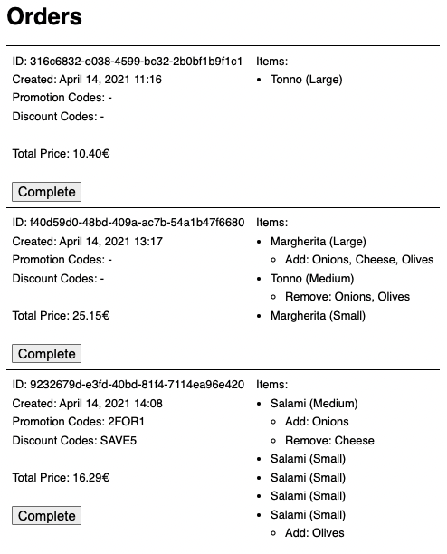

# How to run the app

#### Using docker:

```
docker compose up # or docker-compose up
```

Visit [http://localhost:3000](http://localhost:3000)

#### Ruby way:

Install ruby 3.2.2, postgres and redis

```bash
bin/setup
rails s
```

Visit [http://localhost:3000](http://localhost:3000)

# Evermood Rails Coding Challenge

We are excited that you are interested in performing our coding challenge. The purpose of this assignment is to see how you approach problems and evaluate the quality of your code.


## The task and requirements

This challenge is about implementing a simple pizza order overview for a restaurant. All orders need to be listed, with the items they contain, their details and the total price. In addition, it is possible to mark orders as completed.

For this purpose, a small full-stack application is to be created with Ruby on Rails, which provides the backend and a web UI to manage the orders. The UI should look like this:



In [`data/orders.json`](data/orders.json) you will find a sample listing that you can use as a basis for your listing. Use it to fill the corresponding fields in the UI.

Furthermore, to mark orders as completed, you can click on the respective button. It should send a `PATCH` request to a `/orders/:id` backend endpoint to update the order. Completed orders should then simply no longer be displayed in the UI.

At last, the total price for a pizza order is to be calculated and displayed. For a pizza order several pizzas can be ordered, per pizza the desired size and also special requests (extra ingredients and omit ingredients) can be specified. In addition, there is a possibility to reduce the price of the order by using various discount codes.

- The price of a pizza depends on the size. Per size there is a "multiplier" that is multiplied by the base price of the pizza.
- Extra ingredients are also provided with this multiplier.
- Ingredients that are omitted during preparation do not change the price of the pizza.
- Promotion codes allow to get pizzas for free; e.g., two small salami pizzas for the price of one. Extra ingredients will still be charged though. Multiple promotion codes can be specified per order. A promotion code can also be applied more than once to the same order (a 2-for-1 code automatically reduces 4 pizzas to 2 for one order).
- A discount code reduces the total invoice amount by a percentage.

In [`data/config.yml`](data/config.yml) you can find the list of selectable pizzas, the multipliers and ingredients, as well as the promotion and discount codes.


## How to proceed and submit the solution
- Arrange your time as you like. We are interested in you finding a solution you are happy with, not speed. But please do not spend more than 4 hours. 
- Create a private repository and checkout a feature branch.
- Push your solution and work with git like you would on a real project.
- Open a pull request when you are ready.
- Add us to the repository and mention us in the pull request, so we can take a look at your solution.
- Feel free to contact us at any time by mail with questions or difficulties.


## What we are looking for
- Does your solution work technically correct and is executable? Did you follow the instructions?
- Is your code well written and easy to read and understand? Did you use a linter?
- Are you following the usual conventions for Ruby on Rails development?
- How good are you at writing tests? And how easy are they to read and understand?
- How well is your solution documented? Are all steps for installation and execution described?
- How proficient are you in using git?
